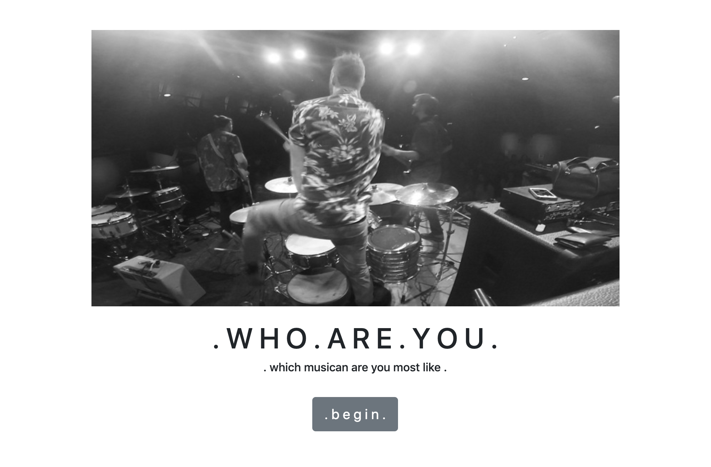
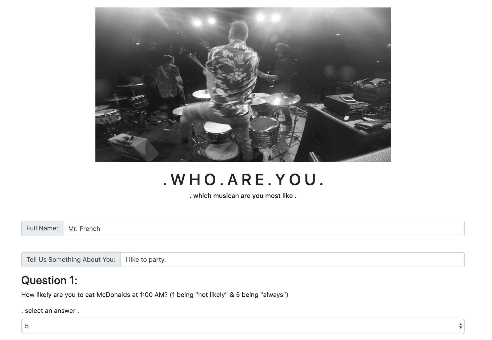
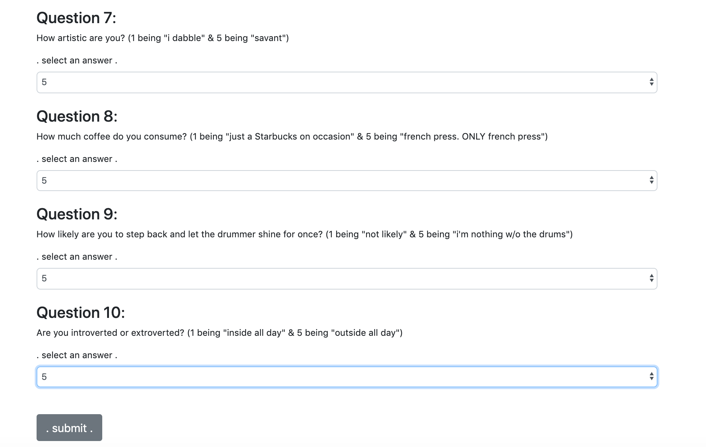
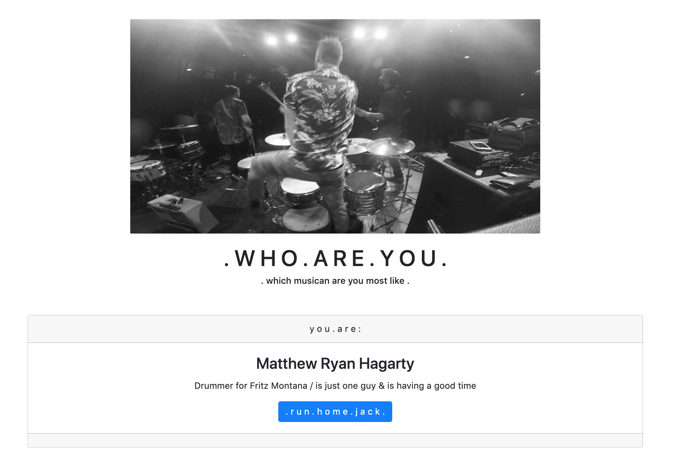

# . w h o . a r e . y o u .

This is my submission for assignment eleven: Friend Finder - Node and Express Servers. We were tasked with creating a compatibility-based "Friend Finder" application. This full-stack site takes in results from a user survey and then compares their answers with those from other users; finding a companion that matches their profile (in my case, a musician). In order to accomplish this, I had to utilize my understanding of express npm, Node.js, jQuery, JavaScript, Bootstrap, HTML, CSS, and REST API.

# Tech I Used:

[Node.js](https://www.w3schools.com/nodejs/)

[HTML](https://www.w3schools.com/html/)

[Bootstrap](https://getbootstrap.com/docs/4.3/getting-started/introduction/)

[CSS](https://www.w3schools.com/css/)

[JavaScript](https://www.w3schools.com/js/)

[jQuery](https://www.w3schools.com/jquery/)

[express npm](https://www.npmjs.com/package/express)

[REST API](https://restfulapi.net/)

Author: [Matthew Hagarty](https://github.com/matthewryanhagarty)